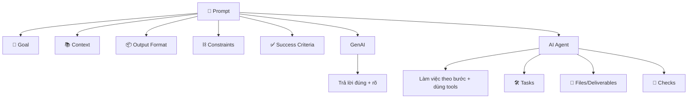

🧠 # Prompt cho GenAI & AI Agent (Cấu trúc + Mẫu dùng ngay)

## 🎯 0) Ý tưởng cốt lõi
- **GenAI (chat/LLM)**: mục tiêu là *câu trả lời đúng, rõ, đúng format*.
- **AI Agent**: mục tiêu là *hoàn thành việc* (có thể chạy nhiều bước, dùng tool, tạo file, kiểm tra kết quả).

Bạn có thể coi prompt giống như “đề bài + ràng buộc + tiêu chí chấm”.

---

## 🧩 1) Prompt Structure (khung chung)
Dùng khung này cho cả GenAI và Agent:

### ✅ A. Mục tiêu (Goal)
- Bạn muốn đạt được kết quả gì? (1–2 câu)

### ✅ B. Bối cảnh (Context)
- Bạn đang làm ở đâu? (repo/app nào, môn học nào)
- Có dữ liệu/đầu vào gì? (file, đoạn text, link, yêu cầu)

### ✅ C. Đầu ra (Output)
- Muốn output dạng gì? (bullet, bảng, markdown, checklist, code)
- Có cần ví dụ minh hoạ không?

### ✅ D. Ràng buộc (Constraints)
- Ngắn/dài?
- Ngôn ngữ: VN/EN?
- Không làm gì? (không bịa số liệu, không đổi kiến trúc, không thêm tính năng…)

### ✅ E. Tiêu chí đúng (Success Criteria)
- Bạn sẽ coi là “xong” khi nào?
- Ví dụ: “có 3 ví dụ”, “có checklist”, “có hướng dẫn chạy”, “tự kiểm tra lỗi”

---

## 💬 2) Template Prompt cho GenAI (chat trả lời)
Copy và thay phần trong ngoặc:

📌 **PROMPT (GenAI)**
- **Vai trò**: Bạn là (giảng viên/dev/PM/mentor…)
- **Mục tiêu**: (tôi muốn hiểu/soạn/tóm tắt…)
- **Bối cảnh**: (tôi đang học/làm…; đây là dữ liệu…)
- **Yêu cầu output**: (dạng bullet/bảng/markdown; độ dài; có ví dụ)
- **Ràng buộc**: (không dùng từ chuyên môn quá khó / giải thích từ gốc / không bịa)
- **Tiêu chí**: (đủ 5 ý; có 2 ví dụ; có phần “sai lầm hay gặp”)

🧪 Ví dụ nhanh:
- Vai trò: Bạn là gia sư.
- Mục tiêu: Giải thích “REST vs GraphQL”.
- Output: Bảng so sánh + 2 ví dụ API.
- Ràng buộc: Ngắn gọn, dễ hiểu.

---

## 🤖 3) Template Prompt cho AI Agent (làm việc theo bước)
Agent prompt nên có thêm: **Tasks**, **Tools**, **Files**, **Checks**.

📌 **PROMPT (Agent)**
- **Mục tiêu**: (làm X)
- **Phạm vi**: (chỉ trong folder/repo nào; không đụng phần nào)
- **Đầu vào**: (file nào, dữ liệu nào)
- **Việc cần làm (Tasks)**:
  1) …
  2) …
  3) …
- **Đầu ra cần tạo (Deliverables)**:
  - Tạo/đổi file: (tên file)
  - Nội dung: (format)
- **Ràng buộc**:
  - Không thêm tính năng ngoài yêu cầu
  - Giữ style hiện tại
- **Tự kiểm tra (Checks)**:
  - Chạy: (test/build/lint) hoặc checklist thủ công
  - Báo cáo: (kết quả + lỗi nếu có)

🧪 Ví dụ nhanh (dành cho code):
- Mục tiêu: Sửa bug đăng nhập.
- Tasks: tìm nguyên nhân → sửa → viết test.
- Checks: chạy unit tests.

---

## 🧠 4) “Câu thần chú” giúp prompt sắc hơn
- **Nói rõ dữ liệu nguồn**: “Chỉ dựa trên nội dung trong file X”
- **Nói rõ format**: “Trả lời dạng bảng 3 cột”
- **Nói rõ mức chi tiết**: “Giải thích như cho người mới”
- **Nói rõ điều cấm**: “Nếu thiếu dữ liệu, hãy hỏi lại thay vì đoán”

---

## 🗺️ 5) Sơ đồ tư duy (dùng để nhớ nhanh)
Bạn có thể dùng sơ đồ Mermaid này (nếu editor hỗ trợ):

---

## 🧾 6) Prompt mẫu (học phần mềm) theo phong cách folder của bạn
📌 Ví dụ: “Tôi học về thì quá khứ & tương lai”

- Folder: `English/Tenses`
- File: `Past vs Future.md`
- Prompt:
  - Mục tiêu: soạn note dễ học
  - Output: bảng so sánh + 10 câu ví dụ + bài tập + đáp án
  - Constraints: giải thích ngắn, có icon, dễ nhớ

---

### 📝 Ghi chú của bạn
- …
